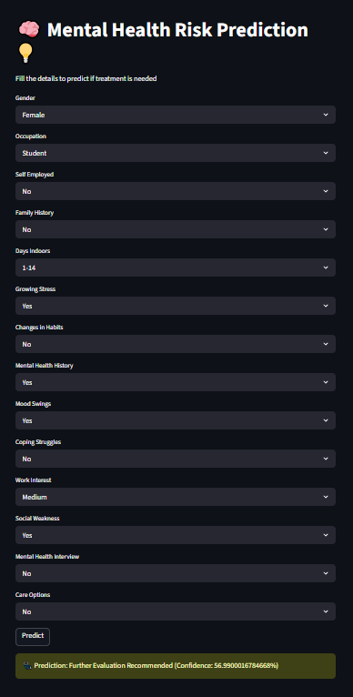

# 📌 Mental Health Risk Prediction System

## 📌 Description
This project is a Machine Learning-based system that predicts an individual's mental health risk level based on various input features such as mood swings, occupation, and lifestyle factors.
The goal is to analyze patterns in behavioral data and provide early insights into mental health conditions.

##📌 Features
- Data preprocessing and feature engineering
- Machine learning model for prediction
- Stress level classification (Yes / No / Maybe)
- Data visualization using graphs
- User input-based prediction (via Streamlit app)

## 📌 Tech Stack
- Python
- Pandas, NumPy
- Scikit-learn
- Matplotlib / Seaborn
- Streamlit

## 📌 How to Run
pip install -r requirements.txt
streamlit run app.py

##📌 Files in Project
- app.py → Streamlit web app
- model.pkl → Trained ML model
- scaler.pkl → Data scaler
- requirements.txt → Dependencies
- Mental_Health_Risk_Prediction.ipynb → Model training notebook

## 📌 Results
The model predicts mental health risk with good accuracy and provides insights using visualizations.

## 📌 Future Improvements
- Improve model accuracy
- Deploy on cloud
- Add real-time API integration

## 📸 Streamlit App Interface

This is the user interface of the Mental Health Risk Prediction system where users can input their details and get predictions.

## 🚀 Demo Video 
[Click here to use the app](https://youtu.be/DEz7kyL1ENA)
